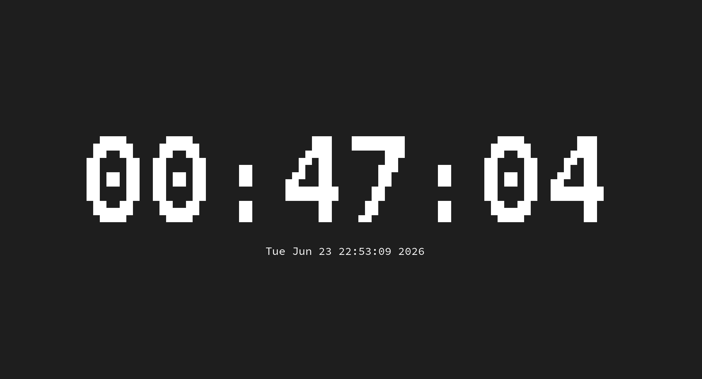
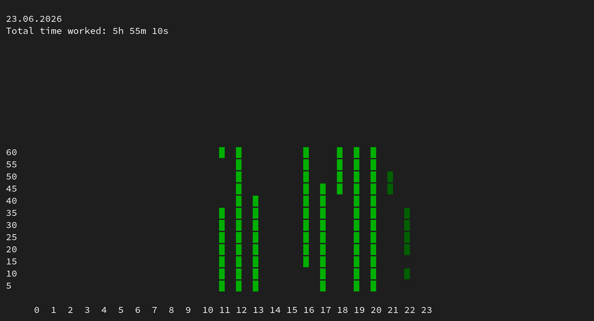

# ⏱️ TTimer

> [!WARNING]
> **TTimer is currently under development.** Features may change, and you might encounter bugs.

**TTimer** is a lightweight, terminal-based time tracking application built in C. Designed for developers and terminal enthusiasts.

## ✨ Features

- **Real-time Tracking:** A terminal-rendered timer that supports several fonts.
- **Data Persistence:** Automatically saves your sessions and settings to a local **SQLite** database (bundled with the project).
- **Visual Analytics:** Built-in graph view to visualize your time-tracking history.
- **Customizable:** Configure app behavior (e.g., auto-start, save on exit) via the settings menu.
- **Keyboard Driven:** Fully navigable via intuitive hotkeys.

## 📸 Screenshots

### Timer View


### Graph View


## 🚀 Quick Start

### Prerequisites

**Supported OS:** Linux, MacOS.
*Note: Idle time traking is available for MacOS and X11-based Linux*

Ensure you have the following installed:
- `clang` or `gcc`
- `ncurses` (with wide-character support)

*Note: SQLite3 is bundled with the source code, so no separate installation is required.*

### Installation

1. Clone the repository (including submodules):
   ```bash
   git clone --recursive https://github.com/corvus5e/ttimer.git
   ```

2. Build the project:
   ```bash
   cd ttimer
   make
   ```

3. Run TTimer:
   ```bash
   make run
   ```

## ⌨️ Keybindings

| Key | Action |
|-----|--------|
| `Space` | Start / Pause / Resume timer |
| `s` | Open **Settings** |
| `g` | Open **Graph / Stats** |
| `h` | Open **Help** |
| `ESC` | Return to Timer view |
| `q` | Quit and save session |

## 🛠️ Built With

- **C** - The core language.
- **Ncurses** - For the terminal user interface.
- **SQLite3** - For robust data persistence.
- **HomeTUI** - A custom UI library developed specifically for this project.

---

